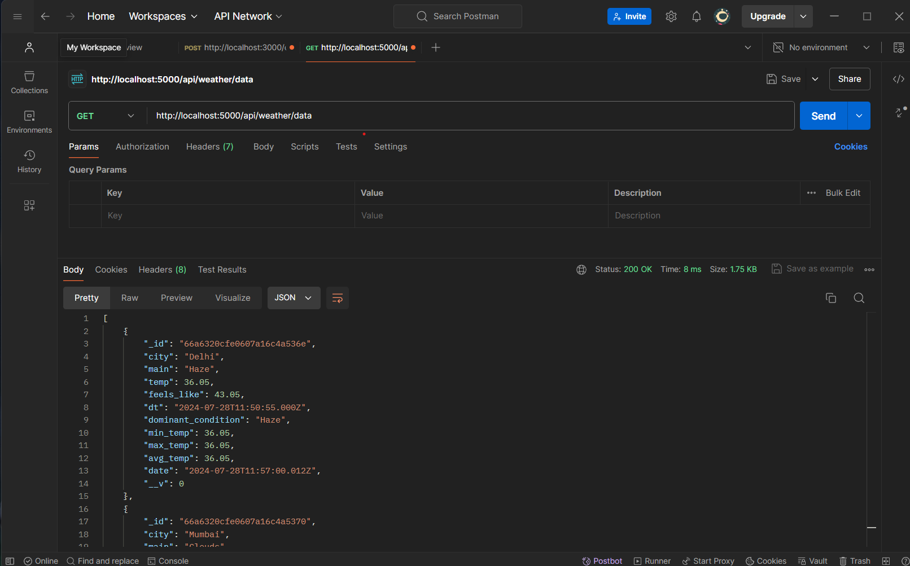
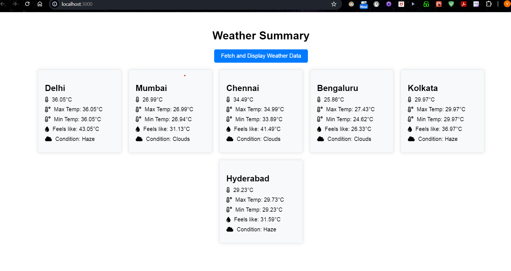

# Weather Monitoring System

## Overview

The Weather Monitoring System is a web application designed to provide real-time weather updates for multiple cities. It fetches data from the OpenWeatherMap API and displays it in an organized manner, showing details like temperature, weather conditions, and humidity. This application is built using the MERN (MongoDB, Express.js, React, Node.js) stack.

## Features

- **Real-Time Weather Data**: Fetches current weather data for a list of cities.
- **Weather Summary**: Displays weather conditions, temperature, feels-like temperature, maximum temperature, minimum temperature, and humidity.
- **Automatic Updates**: Fetches and updates weather data at regular intervals.
- **User-Friendly Interface**: Responsive and easy-to-navigate UI with icons for weather conditions.

## Tech Stack

- **Frontend**: React.js
- **Backend**: Node.js, Express.js
- **Database**: MongoDB
- **API**: OpenWeatherMap API

## Installation

### Prerequisites

- Node.js
- MongoDB
- npm (Node Package Manager)
- OpenWeatherMap API Key

### Steps

1. **Clone the repository**

    ```sh
    git clone https://github.com/Vaaneesh/weather-monitoring-system.git
    cd weather-monitoring-system
    ```

2. **Backend Setup**

    - Navigate to the backend directory

        ```sh
        cd backend
        ```

    - Install the dependencies

        ```sh
        npm install
        ```

    - Create a `.env` file in the backend directory and add your OpenWeatherMap API key

        ```env
        OPENWEATHER_API_KEY=your_openweathermap_api_key
        MONGO_URI=your_mongodb_uri
        ```

    - Start the backend server

        ```sh
        npm run server
        ```

    


3. **Frontend Setup**

    - Navigate to the frontend directory

        ```sh
        cd ../frontend
        ```

    - Install the dependencies

        ```sh
        npm install
        ```

    - Start the frontend development server

        ```sh
        npm start
        ```

4. **Concurrent Start**

    - You can also start both frontend and backend concurrently using the root package script

        ```sh
        npm run dev
        ```

## Usage

- Open your browser and navigate to `http://localhost:3000`
- Click on the "Fetch and Display Weather Data" button to load the weather data for the predefined cities.
- The weather data will be displayed in a user-friendly format with icons representing different weather parameters.


